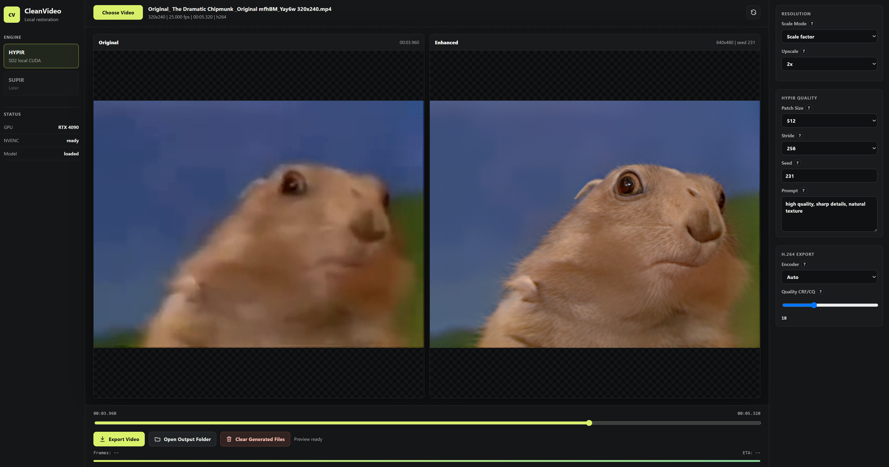

# CleanVideo

Local video enhancement UI for HYPIR and video-native restoration engines with CUDA preview and H.264 export.



## Run

On Windows, double-click:

```text
Start-CleanVideo.cmd
```

It starts the local server if needed and opens <http://127.0.0.1:8765>.
If an idle CleanVideo server is already running, the launcher restarts it so the latest local code is used.
On first launch, it also runs setup automatically if required. The setup checks/install/downloads:

- `uv` and a Python 3.10 virtual environment.
- Python inference dependencies, including PyTorch CUDA wheels.
- FFmpeg / ffprobe for frame extraction and H.264 export.
- HYPIR and SUPIR source trees.
- HYPIR weights and the Stable Diffusion 2.1 base model files.

If an automatic download fails, the console prints the exact manual download URL and the local folder/file where it must be placed.

From Codex, use the Run menu action:

```text
Launch CleanVideo
```

Use `Force Restart CleanVideo` only after stopping any export you want to keep running.

Server-only mode:

```powershell
.\run.ps1
```

## What is installed

- `external/HYPIR`: XPixelGroup HYPIR checkout, created by setup.
- `external/SUPIR`: SUPIR checkout reserved for a later engine switch, created by setup.
- `external/SeedVR2_VideoUpscaler`: SeedVR2 local CLI/Comfy implementation used by the app.
- `external/FlashVSR`: official OpenImagingLab FlashVSR checkout.
- `external/Block-Sparse-Attention`: required FlashVSR LCSA backend checkout; Windows build is blocked, WSL build is used.
- `models/hypir/HYPIR_sd2.pth`: HYPIR-SD2 LoRA weights, created by setup.
- `models/seedvr2`: SeedVR2 3B FP8 DiT and VAE weights.
- `models/stable-diffusion-2-1-base`: Diffusers-format Stable Diffusion 2.1 base mirror, created by setup.
- `.venv`: Python 3.10 virtual environment with `torch 2.6.0+cu124`.
- `.venv-seedvr2`: isolated SeedVR2 Python 3.10 environment.
- `.venv-flashvsr`: isolated Windows FlashVSR Python 3.11 environment, kept for status/probing.
- WSL FlashVSR runtime: `/home/user/.cleanvideo/flashvsr-wsl/.venv` with PyTorch 2.6.0+cu124, plus `/home/user/.cleanvideo/cuda-12.4` with local `nvcc`.

## Engine support

CleanVideo currently exposes:

- `HYPIR`: working per-frame high-quality restoration, with HYPIR LoRA Film Adapter training, second pass, frame cache, and partial export.
- `SeedVR2`: working video-native restoration through the local SeedVR2 CLI. Preview uses a single extracted frame; export processes the whole video to preserve model temporal consistency, then remuxes the original audio.
- `FlashVSR`: working through the WSL bridge. The official v1.1 code, weights, and Block-Sparse-Attention/LCSA quality path are used; the Windows-native path remains blocked and is not used.

The local, high-quality video-native candidates reviewed for parity with HYPIR/SUPIR are:

- `SeedVR2`: strongest next candidate for generic local video restoration. It is a one-step diffusion video-restoration model with official local code and models, built for temporal consistency rather than per-frame enhancement. Caveats: prototype models can over-generate on lightly degraded input, and the official stack brings heavyweight CUDA dependencies such as FlashAttention/Apex. Source: <https://github.com/ByteDance-Seed/SeedVR>.
- `FlashVSR`: strong candidate for fast 4x video super-resolution. It has official local code and model weights, targets streaming one-step diffusion VSR, and is designed around high-resolution throughput. Caveats: it is primarily optimized for 4x SR and depends on Block-Sparse-Attention, whose best-tested hardware path is datacenter NVIDIA GPUs; consumer RTX support needs validation before bundling. Source: <https://github.com/OpenImagingLab/FlashVSR>.

Other high-quality local methods were reviewed but are lower priority for this app today. `DiffVSR`, `STAR`, `MGLD-VSR`, and `Upscale-A-Video` are relevant diffusion VSR projects, but they are much heavier or slower for interactive local export. `VEnhancer` is strong for AI-generated video enhancement and space-time upsampling, but its official single-GPU path expects very large VRAM. `VideoGigaGAN` is quality-relevant but not currently practical to add until public code and weights are available. Older image/frame methods such as Real-ESRGAN, StableSR, ResShift, SeeSR, DiffBIR, PASD, and OSEDiff do not clearly justify integration ahead of SUPIR because HYPIR already covers the high-quality per-frame restoration lane with better speed and a local CUDA path.

The app uses PyTorch CUDA for HYPIR inference and `h264_nvenc` for H.264 export when available. If NVENC fails, the backend falls back to `libx264`.

During HYPIR export, enhanced frames are cached as PNG files under `work/cache` using the selected video and HYPIR settings. If the app is stopped mid-export, starting the same export again reuses already enhanced frames instead of generating them again. SeedVR2 is a video-native engine and does not expose partial frame export. FlashVSR `Tiny Long` and `Tiny` exports run as a single streaming model session that keeps the model context across the video instead of splitting the source into independent 21-frame files. During those streaming exports, the UI shows the latest ready full-resolution source/enhanced JPEG pair in the same draggable comparison view used by preview, while overwriting only two live files instead of saving all frames. The older 21-frame chunked path remains only as a fallback for `Full`, so `Save Partial` is still chunk-based for that fallback variant but is not available during `Tiny Long` or `Tiny` streaming. After a finished H.264 export, temporary cache files are scheduled for automatic cleanup. `Clean All` deletes everything under `work`, including source uploads, exports, previews, cache, partial videos, job records, and film adapters, then recreates the empty working folders. The browser also stores the last selected server-side video id, active job id, and UI settings in `localStorage`.

The `Temporal` export setting reduces frame-to-frame flicker by optical-flow warping the previous enhanced frame onto the current source frame and blending stable areas after each HYPIR pass. `Medium` is the default balance; `Strong` and `Extra Strong` can be steadier but may soften fast motion or add ghosting, and `Off` preserves the old independent-frame behavior.

The `0.5x` scale factor performs high-quality Lanczos downscaling before HYPIR enhancement, producing half-width and half-height output while giving the generator a smaller, cleaner input.

`Create Film Adapter` samples the selected video into 512x512 training patches, starts a local HYPIR LoRA fine-tune job, and saves the resulting adapter under `work/adapters`. The `Adapter Quality` preset controls adaptive sampling and training length. `Fast` uses 64-160 selected frames, 1 patch per frame, and 240-600 steps. `High` uses 192-768 selected frames, 2 patches per frame, and 900-3000 steps. `Extra` uses 480-1600 selected frames, 2 patches per frame, and 1500-6000 steps. Longer videos automatically get more selected frames up to the preset cap. The sampler extracts extra candidate frames across the full video, filters very dark, low-detail, or near-duplicate frames, and uses temporary checkpoints during training. If the trainer exits with an error before the target step, CleanVideo rewrites the training config to resume from the latest checkpoint and retries up to 3 times. If the saved checkpoint already reached the target step, it is treated as complete. After the adapter is ready, source samples, patches, training metadata, logs, older checkpoints, and optimizer checkpoint files are deleted; only `adapter.json` and the final `state_dict.pth` are kept.

`Second Pass` can run `Base after adapter` for preview/export. This first enhances with the selected film adapter, then runs Base HYPIR at 1x as a refinement pass before temporal stabilization. It is experimental and much slower, but useful to compare when an adapter preserves film style well and Base HYPIR adds cleaner detail on top. Adapter training is experimental: it can take a long time and may overfit noisy footage.

Film Adapter training is currently HYPIR-only. SeedVR2 public code includes training configs, but not a supported local video-to-adapter workflow comparable to the HYPIR LoRA adapter. FlashVSR publishes inference code and describes the training approach, but no released local video-to-adapter workflow is available for this app.

## FlashVSR status

FlashVSR v1.1 was downloaded and its Python environments were installed, including the official weights:

- `diffusion_pytorch_model_streaming_dmd.safetensors`
- `LQ_proj_in.ckpt`
- `TCDecoder.ckpt`
- `Wan2.1_VAE.pth`

The official implementation requires Block-Sparse-Attention/LCSA for the quality path. On this Windows machine, `external/Block-Sparse-Attention` reached CUDA compilation but failed:

```text
nvcc / CUDA 12.8 + Visual Studio Build Tools 18
cudafe++ died with status 0xC0000005 (ACCESS_VIOLATION)
```

WSL2 Ubuntu is now the active FlashVSR backend. Because `sudo` requires an interactive password, the runtime was installed fully in user space:

- Python 3.11 via `uv`: `/home/user/.cleanvideo/flashvsr-wsl/.venv`
- CUDA 12.4 `nvcc` via micromamba: `/home/user/.cleanvideo/cuda-12.4`
- Block-Sparse-Attention built on Linux ext4 under `/home/user/.cleanvideo/src/Block-Sparse-Attention`
- CleanVideo bridge runner: `scripts/flashvsr_wsl_python.sh`

The build had to run from WSL ext4. Building from `/mnt/c` progressed but `nvcc` segfaulted; resuming from ext4 completed and `block_sparse_attn_cuda` imports successfully when `LD_LIBRARY_PATH` includes PyTorch and CUDA libraries. Dense-attention/community fallback is intentionally not enabled because the official FlashVSR README warns that missing LCSA can noticeably degrade quality.

FlashVSR's official pipeline needs enough frames for its temporal loop. CleanVideo pads `Tiny Long` and `Tiny` streaming with cloned tail frames and trims the output back to the source frame count. The preview helper still creates a 21-frame still clip for FlashVSR previews.

Use the trash button next to `Film Adapter` to delete a completed adapter, or `Delete All Adapters` to remove every film adapter at once. Deleting adapters removes checkpoints, patches, sampled frames, logs, and metadata under `work/adapters`; `Base HYPIR` cannot be deleted.

## Reinstall dependencies

```powershell
.\scripts\setup.ps1
```

To only install missing items:

```powershell
.\scripts\setup.ps1 -IfNeeded
```

HYPIR is licensed for non-commercial use by its upstream project. The official `stabilityai/stable-diffusion-2-1-base` Hugging Face repo was unavailable during setup, so the local base model was downloaded from a public diffusers-compatible mirror.
